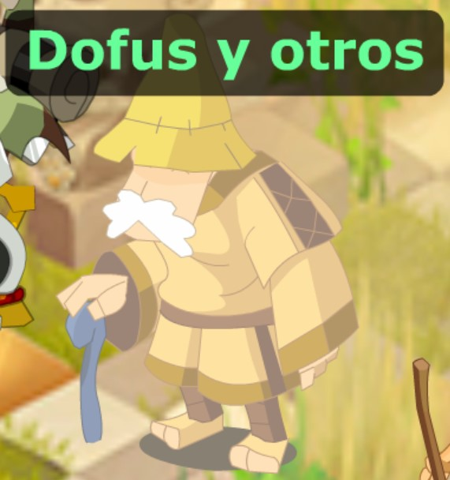
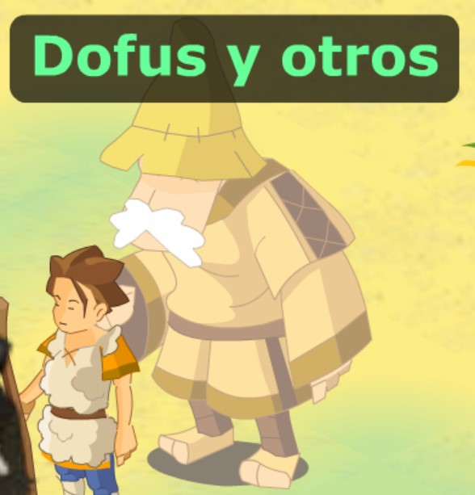

# 🔅Dofus Iniciales

**Habrán dos clasificaciones de dofus que deberás tener en cuenta:**

* <mark style="color:red;">**Dofus CLASICOS version 1.29**</mark>: Sirven solo para ayudarles a subir al nvl 200 y si desean hacer pvp con items clasicos de dofus.
* <mark style="color:green;">Dofus - trofeos FUN propios de Landfus</mark>: Todos los dofus que son mejores en stats que los de la versión 1.29 clásicos.

## 1. <mark style="color:red;">Dofus clásicos versión 1.29</mark> por kamas  \[Opcional su utilización]&#x20;


Ir al apartado de [Guía de Dofuces](../../../de-interes/guia-de-dofuces.md) **(Click sobre el link)** para observar los stats de cada dofus


|                                                               Valor en kamas                                                               |                                                                          Dofus                                                                          |                                                               Valor en kamas                                                                |                                                                        Dofus Mega                                                                       |
| :----------------------------------------------------------------------------------------------------------------------------------------: | :-----------------------------------------------------------------------------------------------------------------------------------------------------: | :-----------------------------------------------------------------------------------------------------------------------------------------: | :-----------------------------------------------------------------------------------------------------------------------------------------------------: |
| 50.000 |      Dofus Ocre      | 500.000 |      Dofus Ocre      |
| 50.000 |   Dofus Turkesa   | 500.000 |   Dofus Turkesa   |
| 50.000 | Dofus Zanahowia | 500.000 | Dofus Zanahowia |
| 50.000 | Dofus Esmeralda | 500.000 | Dofus Esmeralda |
| 50.000 |    Dofus Vulbis    | 500.000 |    Dofus Vulbis    |
| 50.000 |   Dofus Purpura   | 500.000 |   Dofus Purpura   |
| 50.000 |   Dofus Kalipto   | 500.000 |   Dofus Kalipto   |


Para comprar estos dofus busquen el NPC Dofus y otros - Ubicación del npc: mapa inicial de la isla de leveo y en .shop suban dos mapas y luego uno a la derecha.


<figure><figcaption>
Utilizar comando .misiones y ir al mapa de la derecha
</figcaption></figure>

 

<figure><figcaption>
utilizar comando .zonas y ir a la isla de leveo
</figcaption></figure>

## 2. <mark style="color:green;">Dofus - Trofeos FUN</mark> por fragmentos K.O 

Los fragmentos KO podrán conseguirlos en la mazmorra K.O. Para ir a esta mazmorra pueden utilizar el comando <mark style="color:blue;">.mazmorras</mark> y al llegar deben hablar con el npc <mark style="color:red;">Mazmorra I (Faciles)</mark> y seleccionar \[Deseo ir a la Dung K.O]. Al finalizar la mazmorra obtendrán un drop fijo de 99 Fragmentos K.O

<figure><figcaption>
NPC MAZMORRA I (FACILES)
</figcaption></figure>


Nota: Mazmorra en la cual la pueden pasar con un solo personaje. Recomendación ocra o feka de inteligencia  para mayor rapidez.


<table><thead><tr><th width="196" align="center">Nombre del Dofus</th><th width="207" align="center">Valor</th><th width="183" align="center">Nombre del Trofeo</th><th align="center">Valor</th></tr></thead><tbody><tr><td align="center">Dofus Dammage</td><td align="center">500</td><td align="center">Robusto Mayor</td><td align="center">350</td></tr><tr><td align="center">Dofus Inte/Cha</td><td align="center">500</td><td align="center">Genio Mayor</td><td align="center">350</td></tr><tr><td align="center">Dofus Fo/Agi</td><td align="center">500</td><td align="center">Suertudo Mayor</td><td align="center">350</td></tr><tr><td align="center">Dofus K.O</td><td align="center">500</td><td align="center">Ligero Mayor</td><td align="center">350</td></tr><tr><td align="center"></td><td align="center"></td><td align="center">Ojo de Aguila</td><td align="center">350</td></tr><tr><td align="center"></td><td align="center"></td><td align="center">Implacable</td><td align="center">350</td></tr></tbody></table>

## 3. <mark style="color:green;">Dofus - trofeos FUN</mark> por fichas \[<mark style="color:yellow;">Landfichas - Venefichas - Rambofichas</mark>]

Este tipo de fichas con el objetivo de mejorar su equipo puede obtenerlas en la isla de leveo, peleando con el montruo kanugro donde lo encontraras hasta en un grupo de maximo 3. La ubicacion exacta de este moob esta en la pos (-40,-15) ezquina inferior derecha de la isla de leveo. Al matar este oob obtendran como drop 30 fichas de cada tipo.&#x20;

<figure><figcaption></figcaption></figure>


Nota: Zona en la cual la pueden pelear con un solo personaje. Recomendación ocra o feka de inteligencia  para mayor rapidez.


<table><thead><tr><th width="195" align="center">Nombre del Dofus </th><th align="center">Valor</th><th align="center">Nombre del Trofeo</th><th align="center">Valor</th></tr></thead><tbody><tr><td align="center">Dofus Agil</td><td align="center">500 Venefichas</td><td align="center">Robusto Evolucionado</td><td align="center">400 Landfichas</td></tr><tr><td align="center">Dofus Machote</td><td align="center">500 Venefichas</td><td align="center">Genio Evolucionado</td><td align="center">400 Landfichas</td></tr><tr><td align="center">Dofus Rojo</td><td align="center">500 Venefichas</td><td align="center">Suertudo Evolucionado</td><td align="center">400 Landfichas</td></tr><tr><td align="center">Dofus Suertudo</td><td align="center">500 Venefichas</td><td align="center">Ligero Evolucionado</td><td align="center">400 Landfichas</td></tr><tr><td align="center">Dofus Evolution</td><td align="center">40 Landfichas </td><td align="center"></td><td align="center"></td></tr><tr><td align="center">Dofus Cachondo</td><td align="center">40 Landfichas</td><td align="center"></td><td align="center"></td></tr><tr><td align="center">Dofus Tóxico</td><td align="center">40 Landfichas</td><td align="center"></td><td align="center"></td></tr></tbody></table>


Si desean conocer los stats exactos de cada dofus y trofeo pueden ir a la [**Guia de Dofuces**](../../../de-interes/guia-de-dofuces.md) **(Click sobre el link)**

