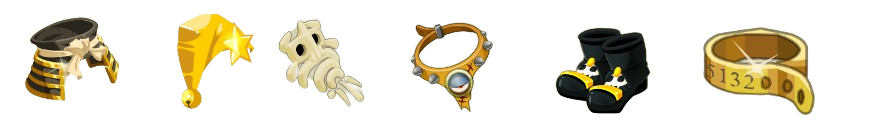
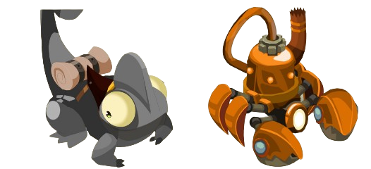
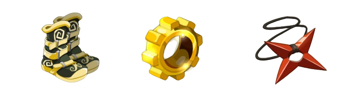

# 👥 Etapa intermedia Multicuenta

En esta etapa, tú y tu equipo ya dominan las mecánicas básicas del juego y están listos para afrontar nuevos desafíos. Las mazmorras intermedias y difíciles te esperan con recompensas increíbles, como el **set inmortal** y **diversos objetos** que potenciarán tu aventura.

**Conquistando las mazmorras intermedias:**

* **Set inmortal:** Demuestra tu destreza en las mazmorras **fantasma, skonk, pandora y dragocedro**. Cada una te dará la oportunidad de obtener piezas de este codiciado set que te brindará una notable mejora en tus estadísticas.
*

    <figure><figcaption></figcaption></figure>
* **Dofus:** Refuerza tu estrategia con **dofus específicos** que se ajustan a tu elemento en las mazmorras de los campos y las llanuras.
*

    <figure><figcaption></figcaption></figure>
* **Mascotas:** Aumenta tu compañía y tus habilidades con **kramsito** o **kram kram**, dos adorables mascotas que puedes obtener en las mazmorras difíciles.
*

    <figure><figcaption></figcaption></figure>

**Explorando más allá:**

* **Mazmorra de peluches:** ¡Diviértete y completa esta mazmorra para obtener peluches de tofu, jalato o blob! Canjéalos en la tienda por el set que mejor se adapte a tu estilo de juego y maximiza tu potencial.

<figure><figcaption></figcaption></figure>

<figure><figcaption>
(algunas partes de set peluche)
</figcaption></figure>

* **Escudo "anticoronavirus":** Protege tu estilo con este peculiar escudo que puedes obtener farmeando **peluches de medilubo** en la zona de chapas.

<figure><figcaption></figcaption></figure>

**Mazmorras mas desafiantes**&#x20;

**Felicidades por haber completado las mazmorras intermedias!** Ahora estás listo para enfrentar nuevos desafíos y obtener recompensas aún más increíbles.

**Tu siguiente objetivo:**

* **Dofus laravel:** Esta dofus  te otorgará bonificaciones significativas en vitalidad, resistencia, daños y otras características

<figure><figcaption></figcaption></figure>

**¿Cómo obtenerl0?**

* **Mazmorra Beso Negro:** Esta mazmorra legendaria te pondrá a prueba con enemigos desafiantes y mecánicas complejas.
  * **Requisitos:** Para entrar a la mazmorra Beso Negro, necesitas:
    * **Set de peluches:** Completa la mazmorra de peluches y canjea los peluches de tofu, jalato o blob por el set que mejor se adapte a tu elemento.
      * **Kramsito o Kram kram:** Consigue estas adorables mascotas en las mazmorras intermedias y difíciles.

**¡Enhorabuena por obtener el Dofus laravel!** Ahora estás listo para embarcarte en una nueva aventura: la misión **Velo de Tinta**.

**En esta misión, deberás:**

* **Recolectar objetos especiales:**
  * **Tinta de Kralamar gigante x10:** Enfréntate al temible Kralamar en la **tubería nauseabunda**, accesible a través del transportador en **.shop**.
  * **Grano de Snoop Dog, Barba de Maluma y Cola de Wiz Khalifa:** Derrota a los **moobs** de la **isla Ayuwoki**.
  * **Buñuelo de Peki:** Completa la **mazmorra Pekki**.

**Entrega los objetos al NPC:**

* **Ubicación:** Encuentra al NPC al lado del **Zaap de .tienda Fus**.

<figure><figcaption></figcaption></figure>

**Recompensa:**

* **¡Capa velo de tinta mejorada!**

<figure><figcaption>
Así luce la capa velo de tinta mejorada.
</figcaption></figure>

¡**Un nuevo desafío te espera!**

En el servidor intermedio, algunos **dofus y armas** que son esenciales para tu progreso pueden adquirirse con **ogrinas**. No te preocupes, ¡no es necesario invertir dinero real para obtenerlas! El juego te ofrece **diversas formas de ganar ogrinas** sin necesidad de donar.


Todo se encuentra explicado en la pagina de ogrinas


**Consejos para el éxito:**

* **Únete a un gremio:** Encuentra compañeros de aventura, comparte estrategias y recibe consejos valiosos.
* **Diviértete:** Disfruta del desafío y la camaradería en tu camino hacia la victoria.
