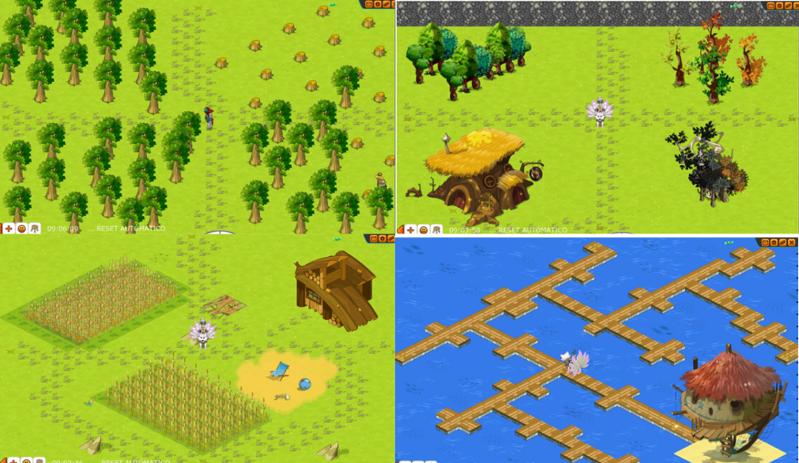

# ✨ Guia de estadisticas

<figure><figcaption></figcaption></figure>

### &#x20;¡Desbloquea el potencial de tu personaje!

### **Puntos de Acción (PA):**

Los **PA** son una unidad de medida que determina la **cantidad de acciones** que un personaje puede realizar en un turno. Las acciones pueden ser:

* **Moverse:** Cada casilla que se mueve un personaje cuesta 1 PA.
* **Atacar:** Los ataques básicos cuestan 1 PA, mientras que los hechizos pueden tener diferentes costos de PA.
* **Utilizar objetos:** Algunos objetos requieren PA para ser utilizados.

### **Puntos de Movimiento (PM):**

Los **PM** son una unidad de medida que determina la **cantidad de casillas** que un personaje puede moverse en un turno.

**Capital de características y hechizos:**

Al subir de nivel, tu personaje gana **5 puntos de capital de características y 1 punto de capital de hechizos**. Estos puntos son un recurso valioso que te permite **personalizar** tu personaje y hacerlo más fuerte.

### **Límite de nivel y puntos totales:**

El límite de nivel en landfus es **200**. Esto significa que, al alcanzar el nivel máximo, habrás acumulado **995 puntos de capital de características y 199 puntos de capital de hechizos**.

### **Solfcaps:**

Cada raza tiene **solfcaps** para cada característica. Los solfcaps determinan la cantidad de puntos de capital que necesitas invertir para aumentar una característica en un punto.

**Visualización en el juego:**

Al subir una característica, puedes ver los solfcaps en la interfaz del juego. La interfaz te mostrará:

* **La cantidad de puntos de capital que necesitas invertir.**
* **El valor actual de la característica.**
* **El valor que tendrá la característica después de la inversión.**

<figure><figcaption></figcaption></figure>

### **Scrolls de características:**

* **Comando .scroll:** Usa el comando ".scroll" en el juego para **subir al máximo** todas tus características de forma instantánea.

### **Pergaminos de hechizos:**

* **Pergaminos de +50 y +100 puntos:** Obtén estos pergaminos para aumentar tus hechizos en **50 o 100 puntos**.
* **Oficio de alquimista:** Crea pergaminos de hechizos con el oficio de **alquimista**. El **lino** es el ingrediente principal para la elaboración de pergaminos.

<figure><figcaption></figcaption></figure>

### Características en Landfus:&#x20;

Las **características** son atributos que definen las capacidades y habilidades de tu personaje en Landfus. Cada una tiene un impacto específico en el juego, tanto en estadísticas base como en la eficacia de hechizos y habilidades.

<figure><figcaption></figcaption></figure>

### **Vitalidad:(VIT)**

\
La vitalidad determina los puntos de vida (PDV) del personaje. Es vital para todas las razas, especialmente para Sacrogritos y Srams por su interacción con hechizos como Castigo y Doble.&#x20;

### **Sabiduría:(SAB)**

\
La sabiduría aumenta la **experiencia obtenida** en combate y **otorga bonus de esquive** a la pérdida de PA y PM. También **aumenta la probabilidad** de **quitar PA y PM** a enemigos. Beneficia a **todas las razas**, especialmente a **Xelors, Fecas, Anutrofs, Aniripsas** y razas con hechizos de **quita PA/PM**.

### **Fuerza:(FO)**

\
La fuerza aumenta el daño de **hechizos de tierra y neutral**. **Incrementa la iniciativa** en 1 punto por cada punto de fuerza y  generalmente los sets de Fo **suben** el daño con **trampas** (dependiendo del set). Ideal para **personajes cuerpo a cuerpo** y builds de **trampas**.

### **Inteligencia:(INT)**

\
La inteligencia aumenta el daño de **hechizos de fuego** y la **efectividad de curas**. **Mejora** las defensas de **hechizos defensivos** e **incrementa la iniciativa** en 1 punto por cada punto de inteligencia. Beneficia a **magos, curanderos** y builds que combinan daño y curación.

### **Suerte:(CHA)**

\
LLa suerte aumenta el daño de **hechizos de agua**. **Aumenta la prospección** en 1 punto por cada 10 puntos de suerte e **incrementa la iniciativa** en 1 punto por cada punto de suerte. Ideal para **builds de daño** que buscan maximizar la probabilidad de críticos.

### &#x20;**Agilidad:(AGI)**

\
La agilidad aumenta el daño de **hechizos de aire**. **Otorga bonus de placaje, huida y GC**. **Incrementa la iniciativa** en 1 punto por cada punto de agilidad y **aumenta la huida y placaje** en 1 punto por cada 10 puntos de agilidad. Beneficia a **personajes con builds de evasión** y control de posición.

\
**10 Puntos de agilidad**, **aumentan los bonus de huida y placaje en 1**\
**50 puntos de agilidad = 5 puntos de Huida**\
**50 puntos de agilidad = 5 puntos de Placaje**

## Características Secundarias&#x20;

### La iniciativa:(INI)&#x20;

**La iniciativa** es un atributo crucial en Landfus que determina **el orden de turno** en el combate. Los personajes con mayor iniciativa actúan antes que aquellos con menor iniciativa.

**Importancia:**

La iniciativa es importante por varias razones:

* **Permite controlar el ritmo del combate:** Los personajes con mayor iniciativa pueden tomar acciones antes que sus enemigos, lo que les da una ventaja estratégica.
* **Permite realizar acciones clave antes que el enemigo:** Acciones como curar aliados, colocar trampas o lanzar hechizos de control pueden ser cruciales si se realizan en el momento oportuno.
* **Permite evitar ataques enemigos:** Los personajes con mayor iniciativa pueden actuar antes que sus enemigos, lo que les da la oportunidad de esquivar o bloquear ataques.

&#x20;**Ejemplo:** sabes cual moob de la sala es el que tiene mas daño y si tienes mas iniciativa que este moob puedes adelantarte al daño y ponerte algun tipo  protección, alejarlo de ti o huir de el mientras organizas tu estrategia.

<figure><figcaption></figcaption></figure>

## **Placaje:**

El **placaje** es una característica secundaria que **reduce la probabilidad de que un enemigo escape** cuando está adyacente al personaje con placaje. Esta probabilidad se calcula en base a la diferencia entre el **placaje del personaje** y la **huida del enemigo**.


si el enemigo te mete placaje **perderás todos tus Pa y Pm**.


<figure><figcaption></figcaption></figure>

## **Huida:**

La **huida** es una característica secundaria que **aumenta la probabilidad de que un personaje escape** cuando está adyacente a un enemigo. Esta probabilidad se calcula en base a la diferencia entre la **huida del personaje** y el **placaje del enemigo**.

<figure><figcaption></figcaption></figure>

**Ejemplo:**

Un personaje con **70 de huida** es atacado por un enemigo con **100 de placaje**. La probabilidad de que el personaje escape es:

**Probabilidad de escape = (70 - 100) / 100 = -0.3**

<figure><figcaption></figcaption></figure>

<figure><figcaption></figcaption></figure>

## Daños:

el daño es un elemento fundamental del combate. Existen diversos tipos de daño y modificadores que afectan su comportamiento. Esta guía describe en detalle las diferentes categorías de daño y sus modificadores, brindando una comprensión técnica para optimizar estrategias de ataque y defensa.

### **Tipos de daño:**

* **Daño estático:** No se puede modificar por ningún medio.&#x20;
* **Daño indirecto:** Proviene de efectos en el personaje, como venenos.
* **Daño directo:** Cualquier otro tipo de daño, incluyendo hechizos, armas y golpes críticos.
* **Daño incurable:** No se puede curar con ningún método, solo prevenirse. Ejemplo: critico de goblithor

### **Modificadores de daño:**

**Daño con armas:**

* **Efecto de área:** Martillos y bastones impactan en un área, pudiendo causar daño colateral a aliados.
* **Dominios:** Incrementan el daño natural o crítico en un porcentaje.
* **Estadística relevante:** Aumenta el daño en base a una estadística específica&#x20;
* **Porcentaje de daño:** Aumenta el daño total en un porcentaje.
* **Daño:** Aumenta el daño en una cantidad fija (limitado a daño físico o mágico).

**Efecto de defensas:**

* **Efecto de escudo:** Reduce el daño directo en una cantidad lineal, dependiendo del elemento y la inteligencia del defensor.
* **Reflejo:** Reenvía una parte del daño recibido al atacante (limitado al daño original). El valor reflejado ahora depende del nivel del defensor.
* **Resistencia:** Reduce el daño directo o indirecto en un porcentaje, dependiendo del elemento.
* **Reducción:** Reduce el daño directo o indirecto en una cantidad fija, sin importar el elemento.

### Críticos:

**Golpe crítico:**

* Ocurre cuando un ataque supera una probabilidad basada en la **agilidad** del personaje y los bonus de **golpe crítico**.
* Inflige un daño **mayor** al normal, que varía según el hechizo o arma utilizada.
* Puede ser crucial para **derrotar enemigos rápidamente** o debilitarlos significativamente.

**Fallo crítico:**

* Ocurre cuando un ataque falla una probabilidad basada en la **precisión** del personaje.
* Provoca que el **personaje pierda el turno**, pasando al siguiente jugador.

<figure><figcaption></figcaption></figure>

### Los puntos de características y el bonificador de daños:&#x20;

**Relación entre puntos de características y %daños:**

Es fundamental comprender que **1 punto de característica** (independientemente del elemento) **equivale a un 1% de daño**. En otras palabras, **50% de daño** equivale a **50 puntos de características**.

Este **bonificador afecta el "daño base"**, siendo el primer factor que se calcula para determinar el "golpe" final mediante la siguiente fórmula:

**Golpe = (Daño base) \* (%daños)**

**Ejemplo práctico:**

Consideremos un Ocra de agilidad con 640 puntos de características en agilidad, un 30% de daño adicional por equipo y un 150% de daño adicional por usar Disparo Potente. Esto se traduce en un total de 820% de daño.

Si un hechizo tiene un "daño base" de 10, el "Golpe" final se calcula como:

**Golpe = (10) \* (820%) = 82**

**Bonificador +Numero de daños:**

Ciertos equipos (y algunas mascotas) **otorgan un bonificador de +N daños**. Este modificador **se aplica directamente al "golpe" final**, incrementándolo en +N.

Siguiendo el ejemplo anterior, si un golpe tiene un valor de 100 y el jugador tiene un bonificador de +60 por equipo, el "golpe" final se incrementa a:

**Golpe final = 100 + 60 = 160**

<figure><figcaption></figcaption></figure>

## Resistencias:

**Las resistencias** son un componente crucial en la defensa de tu personaje en Landfus. Estas **reducen el daño** recibido de los enemigos, ya sea de forma **fija** o en **porcentaje (%)**.

### **Tipos de resistencias:**

* **Resistencias fijas:** Reducen una cantidad fija de daño, independientemente del daño total recibido las reconoces porque  están identificadas con un + al inicio (+20 a la resistencia neutral) y en la ventana de características avanzadas aparecen como resistencia fija.

<figure><figcaption></figcaption></figure>

* **Resistencias porcentuales:** Reducen un porcentaje del daño total recibido las reconoces porque estas tienen un icono cuadrado con cada uno de los elementos     y en la ventana de características avanzadas están señaladas por un (%).

<figure><figcaption></figcaption></figure>

### **Funcionamiento de las resistencias porcentuales:**

Las resistencias porcentuales **no se suman directamente** con las resistencias fijas. En cambio, **se aplican de forma individual** al daño recibido.

**Ejemplo:**

Un personaje con **50% de resistencia a tierra** recibe un ataque de **1000 puntos de daño**. La resistencia porcentual **reduce el daño a la mitad**, lo que significa que el personaje recibe **500 puntos de daño**.

**Cálculo del daño recibido:**

**Daño recibido = Daño original \* (1 - Resistencia porcentual)Consideraciones adicionales:**

* Las resistencias porcentuales son **más efectivas** contra **ataques de alto daño**.
* La **elección de resistencias** depende de la **clase, estilo de juego** y los enemigos que enfrentes.
* Se recomienda **combinar** resistencias fijas y porcentuales para una defensa óptima.

### Resistencias fijas:&#x20;

**Las resistencias fijas** son un componente fundamental en la defensa de tu personaje en Landfus. Estas **reducen una cantidad fija de daño** recibido, independientemente del daño total del ataque.

### **Funcionamiento de las resistencias fijas:**

A diferencia de las resistencias porcentuales, las resistencias fijas **no se acumulan** con otras resistencias. En cambio, **se aplican de forma individual** al daño recibido.

**Ejemplo:**

Un personaje con **24 resistencias fijas a tierra** recibe un ataque de **1000 puntos de daño**. La resistencia fija **reduce el daño en 24 puntos**, lo que significa que el personaje recibe **976 puntos de daño**.

**Cálculo del daño recibido:**

**Daño recibido = Daño original - Resistencia fija**

**Eficiencia de las resistencias fijas:**

Las resistencias fijas son **más efectivas** contra **ataques de bajo daño**. Su principal ventaja es que **anulan completamente** el daño de ataques que sean **inferiores a su valor**.Las resistencias fijas son especialmente **valiosas en PvP**, donde los ataques suelen ser de **menor daño**. En este contexto, las resistencias fijas pueden **anular una gran cantidad de daño** a lo largo de un combate.

<figure><figcaption></figcaption></figure>

**Eficiencia de las resistencias:**

Las resistencias **no son una defensa infalible**. Si un enemigo inflige un daño **mucho mayor** a tu resistencia, aún puedes recibir un daño considerable.

<figure><figcaption></figcaption></figure>

## Reenvío de daños:&#x20;

**El reenvío de daños** es una mecánica en  que permite a un personaje **devolver una parte del daño recibido** a su atacante. Esta mecánica puede ser una herramienta poderosa para **disuadir a los enemigos** y **protegerse de ataques fuertes también hay hechizos que permiten aumentar esta tasa de reenvió de daño como en caso de los fecas con su habilidad "reenvió de hechizos" reenviando un hechizo que provoque perdida de PDV o Pa**.

<figure><figcaption></figcaption></figure>

### **Funcionamiento:**

El reenvío de daños se basa en un **porcentaje** del daño recibido. Este porcentaje puede variar según la fuente del reenvío, como por ejemplo:

* **Hechizos:** Algunos hechizos tienen la capacidad de reenviar un porcentaje del daño recibido.
* **Equipamiento:** Ciertas piezas de equipamiento pueden otorgar un porcentaje de reenvío de daños.
* **Mascotas:** Algunas mascotas pueden otorgar un porcentaje de reenvío de daños.

**Cálculo:**

El daño reenviado se calcula de la siguiente manera:

**Daño reenviado = Daño recibido \* Porcentaje de reenvío**

**Ejemplo:**

Un personaje recibe un ataque de 100 puntos de daño y tiene un +20 de reenvío de daños. El daño reenviado al atacante sería:

**Daño reenviado = 100 \* 0.20 = 20**

## Curaciones:&#x20;

**Definición:**

Las curaciones son una mecánica fundamental en Landfus que permite **restaurar puntos de vida (PDV)** a aliados o incluso enemigos durante el combate. Esta capacidad es crucial para mantener vivos a los personajes y asegurar la victoria.

**Personajes con capacidad de curar:**

* **Aniripsas:** Son los principales curanderos del juego, con una amplia variedad de hechizos y habilidades dedicadas a la curación.
* **Osamodas:** Poseen algunas habilidades de curación, principalmente a través de sus invocaciones.
* **Zurcarák:** Poseen algunas habilidades de curación, principalmente a través de hechizos de daño que también curan.
* **Anutrofs:** Poseen algunas habilidades de curación, principalmente a través de hechizos de sacrificio.
* **Sadidas:** Poseen algunas habilidades de curación, principalmente a través de hechizos de plantas.
* **Hechizo elemental Zanahowia:** Otorga la capacidad de curar a cualquier personaje que lo lance.

<figure><figcaption></figcaption></figure>

**Factores que afectan la curación:**

* **Inteligencia:** Aumenta la **efectividad de las curaciones** en un 1%. Este factor es especialmente importante para hechizos y armas que curan grandes cantidades de PDV.
* **Bonus de curaciones:** Se añaden directamente a la cantidad de PDV curada, similar al funcionamiento del bonus de daños. Este factor es especialmente importante para hechizos y armas que curan pequeñas cantidades de PDV.

**Cálculo de la curación final:**

Para calcular la cantidad de PDV que se curará, se debe considerar:

* **Curación base del hechizo o arma:** La cantidad de PDV que se cura sin ningún modificador.
* **Inteligencia del personaje:** Se aplica un porcentaje equivalente a la inteligencia del personaje.
* **Bonus de curaciones:** Se añade directamente a la cantidad de PDV curada.

**Ejemplo:**

Un **Aniripsas** con 400 de inteligencia y +15 de bonus de curaciones utiliza un arma que cura entre 17 y 25 PDV. La curación final se calcula de la siguiente manera:

**Curación final = Curación base + (Curación base \* Inteligencia%) + Bonus de curaciones**

**Curación final = 17 - 25 + (17 - 25) \* 400% + 15**

**Curación final = 17 - 25 + 68 - 100 + 15**

**Curación final = 100 - 140**

**Esquiva de PA:**

La **esquiva de PA** es una estadística que reduce la probabilidad de que un enemigo te golpee con un hechizo que consume Puntos de Acción (PA).

**Esquiva de PM:**

La **esquiva de PM** es una estadística que reduce la probabilidad de que un enemigo te golpee con un hechizo que consume Puntos de Movimiento (PM)

<figure><figcaption></figcaption></figure>
